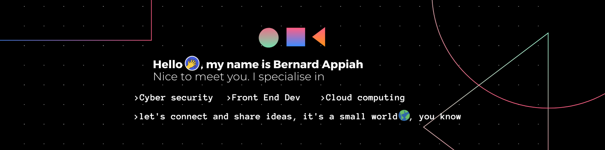

<h1>Click the image below⬇️ to checkout my Social Space🤔</h1>

<h1>Hello, there 👋😅  eloboratedMe.md is  here⬇️ </h1> I'm <b>Bernard Appiah</b>, a passionate professional with a focus on Cyber Security, Cloud Computing, and Front-End Development. I believe in continuously upskilling and staying ahead in the ever-evolving tech industry. With expertise in Cyber Security and Cloud Computing, I possess the knowledge and skills to protect digital assets and develop secure cloud-based solutions.

Additionally, my proficiency in Front-End Development allows me to create visually appealing and user-friendly web applications. I strive for excellence in delivering responsive and optimized front-end experiences.

I am dedicated to expanding my skill set and staying updated with the latest industry trends. Constantly seeking new challenges, I am committed to enhancing my abilities and taking on exciting projects.

Let's connect and explore opportunities to collaborate on projects related to Cyber Security, Cloud Computing, or Front-End Development. I'm always open to learning from others and contributing to innovative solutions. Together, let's make a positive impact in the digital world

  

- 🌱 I’m currently learning **_``software engineering & Cloud Computing @ ALX`` **_``Pursuing a Cybersecurity degree at Accra Technical University``

- 📫 How to reach me **aboa.boni360@gmail.com**

---------
<h3 align="left">Connect with me:</h3>

---------
<h3 align="left">Languages and Tools:</h3>

                          

----------

&nbsp;

